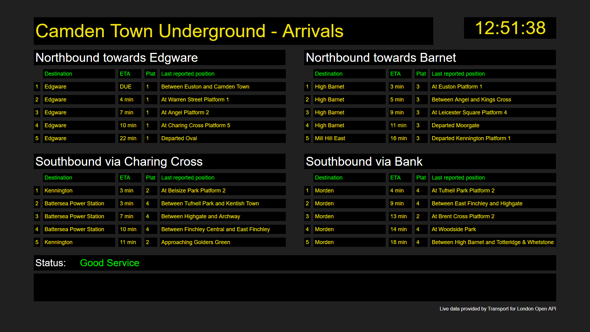
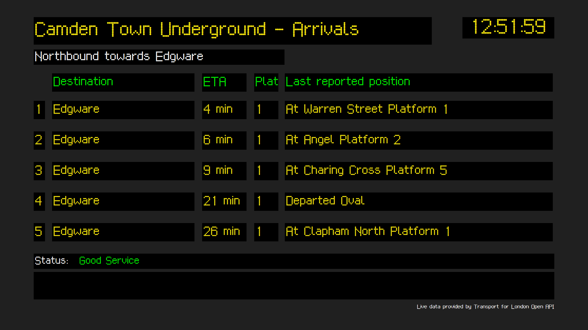

# CasparCG HTML Template Examples

This folder contains several example HTML templates designed for use with CasparCG Server.

The templates are provided "as is" with no warrenty about their function. Using the templates is entirely at the users own risk.

To use a template, copy the html file and any associated files or folders to the CasparCG server folder that is configured for template replay. If using the standard client use the Library Refresh menu item to let the client discover the template which can then be instanced into the client rundown.

Each template example includes a statement of the target resolution, normally full HD at 1920x1080.

## Example_01
This example template displays a simple static lower third with a solid red bar containing two lines of text. The content of the upper text row is set by key f0 sent by the client, the content of the lower row text is set by key f1 sent by the client. Both rows use Arial typeface as this should be availble on all computer system hosts.

To use the template in a CasparCG server copy the file into the server template folder. If a CasparCG client is already running when the file copy occurs, use the library refresh tool in the client to add the new template to the list of templates. The template can be instanced in a rundown, data entered for the f0 and f1 keys then run.

The template also runs in a browser, such as Chrome, by selecting the file in the finder list, right clicking the name and selecting the target program as Chrome browser. When the browser page shows as a blank display, right-click in the display area and choose Inspect which opens a second window that includes a Javascript console. Locate the console tab to make it the focus zone. Enter a command on the console similar to:

``` Javascript
play('{"f0": "My name shows here", "f1": "My job title shows here"}')
```

When entering the above command take great care with the placement of the single and double quotation marks. Some people find the data entry is simplified by using a command that uses the built-in function that converts a JSON object to stringified JSON form:

``` Javascript
play(JSON.stringify({f0:"CasparCG", f1:"Graphics made Cool"}))
```

Chrome was suggested as the browser, as this is closest to the embedded chromium browser used in CasparCG. Other browsers also show the template, but some error messages may be seen on the console display unless they are webkit aware browsers.

The content update process is invoked in a similar fashion:

``` Javascript
update(JSON.stringify({f0:"CasparCG User Forum", f1:"https://casparcgforum.org/"}))
```

Finally the template can be removed by calling the stop function:

``` Javascript
stop()
```

This hides the text, and about 800 ms later closes the browser tab or window.

## Example_02
This example template displays a lower third caption with a name field, a job title/designator field, and an optional hashtag or email name all displayed over a semi-transparent strap. When the template is played it animates all elements onto the display. The animation actions use CSS animation methods coupled with Javascript promises that compute when the animations are complete. The properties of the strap are all defined as CSS variables to speed any design updates or maintenance requiring colour changes , size changes, or display typefaces.

The template requires a bitmap graphic which is stored in a sub-folder of the template folder. The sub-folder is called **_img** and the bitmap file is called **Vale_Viewpoints_44L.png**

Individual fields can be updated. The updated field data from the client is compared with the existing data. Only elements that have changed cause animations to occur.

When the template receives a stop request from the CasparCG client it animates all elements off the screen then closes the html window.

As with Example_01, the template can be run in a browser.

### Listing expected key names
It can be difficult for an operator or user to know what field names were used by the template creator. This template includes a special function that can display the field names. Once the template has been played, potentialy without any content, the function templatekeys(1) causes the names of the keys and a required bitmap to be shown. This overlay display can be removed by a second call to templatekeys(1). The function can be invoked from the standard CasparCG client by entering the the function name in the Invoke field of the template item inspector, then pressing the F7 key to invoke the function.

### Template Debug Facilities
Several features are present just for testing and debugging the template.

Function ToggleBg() shows or hides a full frame still that enables the template display to be seen over the top of a representative background picture. The background picture is provided by the user as a bitmap called **GenericBgnd.jpg** stored in the same _img sub-folder as the programme icon bitmap. A second call to the function removes the background picture display.

Function DoPlay(*n*) simulates the action of playing the template in CasparCG server. The parameter *n* is an integer that selects one of several initial content displays for the template. A value of 0 provides short descriptions of the field content. Values starting at 1 are more representative of real content. If the parameter number does not exist the defult (value 0) information is displayed.

Function DoUpdate(*n*) simulates the action of sending a content update from CasparCG client to server. Several content strings are present, selected to check operations when one, two or all 3 fields change values. One string provides null content for all fields which causes the template to hide the strap. A subsequent call with non-null field content causes the strap to animate onto the output with the new field content in place.

## Example_03
This example shows estimated times of arrivals of tube trains travelling towards Camden Town Underground station in London. The template was designed for display on an in-vision monitor that is part of the studio set. Sometimes the programme director wants a dynamic live display of the train arrivals, sometimes they want a single snapshot from the data feed, and sometimes they want an unchanging data display. They may also want to use different typefaces that look more like those in use by London Transport for some years (before high quality LCD display signage was readily available). All the display options can be adjusted at run time by using key:value pairs.

The estimated time of arrival, platform number and final destination station are all read from the Transport for London (TfL) Open Data API. New data is available, at best, every 30 seconds hence this template polls for a new data report at 30 second intervals. The template updates the expected arrival time every second using the CasparCG Server computer clock.

The template reads a second data service in the TfL API reporting the current status of the Northern Line - for example ___Good Service___ or ___Slight Delays___. This status data is checked once per minute. 

The train and status information can be shown for all 4 routes through the station, or one route's display can be shower at higher resolution. The default display uses Arial typeface as this should be available on all CasparCG server computers. The screen layout is illustrated below.



The template can be instructed to use a different typeface. The image below is a snapshot of the single route display using `London Underground Regular.ttf`, an open source licenced dot-matrix typeface.



Different typefaces do not all show at the same height (differences in X-heights for example). It is a simple process to add a new typeface to those available to the template. As part of this process the end-user edits an array that contains the height, in pixels, for each data display box on the layouts. The user must balance the height of the displayed text against the number of words or letters that can be shown in the destination and current location boxes. Word wrapping is used in the text fields rather than displaying truncated words.

### Controlling the Display Options
The template recognises 4 named keys that can set the operational display functions. These can be passed to the template as part of the AMCP CG PLAY command, or sent as part of an AMCP CG UPDATE command. The support range of values for each key is limited as described below.

Key name: __mode__<br> 
| Value  | Operation |
| ------------- | ------------- |
| dynamic  | Train data and time-of-day clock update once per second. |
| single | Train data is set by fetch from servers when template starts or when user sends a CG UPDATE command setting the mode as single. No clock time is shown.|
| static | Displays a fixed set of data encoded into the template Javascript code.|

Key name: __display__<br> 
| Value(s) | Operation |
| ------ | ------ |
| **all** or **0**| Display all four routes through the station |
| **edgware** or **1**| Display just trains towards Edgware |
| **barnet** or **2** | Display just trains towards Barnet |
| **charing cross** or **3**| Display just trains southband via Charing Cross |
| **bank** or **4** | Display just trains southband via Bank |

Key name: __startat__<br> 
| Value(s) | Operation |
| ------ | ------ |
| off| Use computer clock as the time of day to display |
| 07:30| Start the time of day clock at 07:30:00 and increment time once per second |
| 14:30:25| Start the time of day clock at 14:30:25 and increment time once per second |

Note that leading zeros must be provided in hour, minute and seconds fields.

Key name: __usefont__<br> 
| Value(s) | Operation |
| ------ | ------ |
| 1..n | Font number index to use for the display. Minimum value is 1, maximum value is set by the number of entries in Javascript array __baseFontSizeTable__ |


### Add extra typeface to list of usable typefaces
**Step 1**<br>
Add a copy of the typeface data file (for example **Raleway Dots.ttf**) to the folder that stores the template code. As an end user you are responsible for checking you have the rights to use the typeface.

**Step 2**<br>
Add a new @font-face definition to the start of the CSS code. If there are three @font-face definitions already present add a definition such as:

```CSS
@font-face {
    font-family: "Railway04";
        src: 
        url("Raleway Dots.ttf"),
        local("Times New Roman");
    font-weight: normal; font-style: normal;
}
```
Note the font-family name uses the next integer in the @font-face sequence, 04 in this example. Add any of the "aways present" typeface names as a local name. If the url link fails the typeface defalts to the local entry. A typeface in the list that is very different helps users spot there is an issue with the new font file.

**Step 3**<br>
Add a new CSS selector named .baseFontXX where XX is the number in the newly added font-family name
```CSS
.baseFont04 { font-family: Railway04; }
```

**Step 4**<br>
Locate the set of definitions in the Javascript code that have a first line of the format:<br>
```Javascript
const baseFont03Sizes = [
```
Copy one of the arrays, for example baseFont01Sizes, and edit the first line to contain the new font-family number.

```Javascript
const baseFont04Sizes = [
    {name: "screenTitleFontHeight", height: 60},
    {name: "routeTitleFontHeight", height: 40},
    {name: "trainItemFontHeight", height: 18},
    {name: "panel1TrainItemFontHeight", height: 30},
    {name: "statusHlFontHeight", height: 32},
    {name: "statusDataFontHeight", height: 24},
    {name: "acknowledgeFontHeight", height: 16}
];
```
Once the next step is done you can start to view the fonts (font - an instances of typeface with defined size and weight) and edit the heights as needed for a good visual presentation.

**Step 5**<br>
Add the name of the new baseFontXXSizes array to the array called **baseFontSizeTable**

Before the edit:<br>
``` Javascript
const baseFontSizeTable = [baseFont01Sizes, baseFont02Sizes, baseFont03Sizes];
```

After the edit:<br>
``` Javascript
const baseFontSizeTable = [baseFont01Sizes, baseFont02Sizes, baseFont03Sizes, baseFont04Sizes];
```

**Step 6**<br>
Run the template, and select the new typeface as the active one. Edit the size tables in baseFont04Sizes and re-start the template until you are happy with the 4 section and single section displays.
<br><br>
### Displaying Template in a Computer Browser
The template can be displayed as an HTML page in CasparCG server, or as a page in a standard computer browser (tested in Firefox, Chrome and Safari). The control keys are passed to the template as query parameters appended to the URL address. For example setting the display mode as dynamic showing just the Edgware branch using typeface/font number 3 append 

`?mode=dynamic&display=edgware&setfont=3`

to the URL.

### Listing expected key names (Same as Example02)
It can be difficult for an operator or user to know what field names were used by the template creator. This template includes a special function that can display the field names. Once the template has been played, potentialy without any content, the function templatekeys(1) causes the names of the keys and a required bitmap to be shown. This overlay display can be removed by a second call to templatekeys(1). The function can be invoked from the standard CasparCG client by entering the the function name in the Invoke field of the template item inspector, then pressing the F7 key to invoke the function.